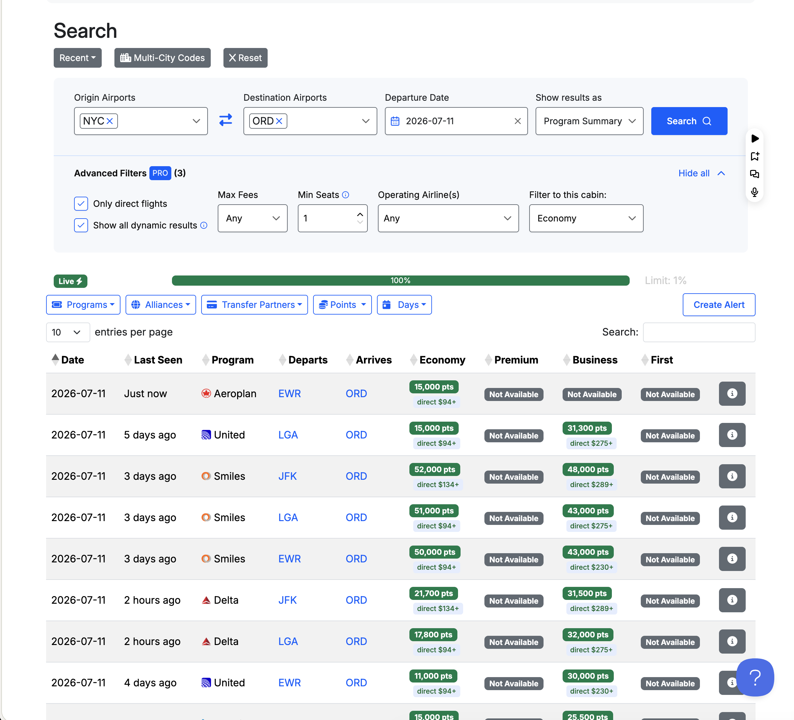

# Seats.aero for Google Flights

A Chrome extension that bridges [Google Flights](https://www.google.com/travel/flights) and [seats.aero](https://seats.aero) for award travel.

Search award availability from Google Flights with one click, and see Google Flights cash prices with cents-per-point (CPP) calculations on seats.aero results.

## Why?

Award travel search is a two-tab problem. You check Google Flights for cash prices, then separately search seats.aero for award availability — manually copying routes, dates, and cabin classes between the two. And even when you find award space, you have no easy way to know if it's actually a good deal.

This extension bridges the gap:

- **From Google Flights**, one click searches seats.aero with all your filters pre-filled — no manual re-entry.
- **From seats.aero**, every award result automatically shows the equivalent Google Flights cash price and a cents-per-point (CPP) value, so you can instantly tell whether burning points is worth it or if you should just pay cash.

A CPP of 2.0+ generally means you're getting great value from your points. Below 1.0 and you're better off paying cash. Without this context, you're flying blind.

## Demo

https://github.com/user-attachments/assets/d69b9272-b720-48ab-a747-9acca5a5d7e3

## Screenshots

| Google Flights | Settings |
|---|---|
|  |  |

| seats.aero — Individual Flights | seats.aero — Program Summary |
|---|---|
|  |  |

## Features

### Google Flights → seats.aero
- **Search button** — appears in the Google Flights filter bar, opens seats.aero with your route pre-filled
- **Smart filter mapping** — automatically transfers origin, destination, date, cabin class, passenger count, nonstop filter, and airline selection
- **Round-trip support** — opens two tabs (outbound + return) for round-trip searches
- **Flexible dates** — optionally search seats.aero with ± N days around your date (popup setting)
- **Keyboard shortcut** — press `Alt+S` on a results page to search without clicking (customizable at `chrome://extensions/shortcuts`)

### seats.aero → Google Flights

Works on both seats.aero views with different levels of detail:

**Individual Flights** — shows the exact cash price and CPP for each specific flight
- Matches the flight number to its specific Google Flights cash price (e.g., "$352 · 1.41cpp")
- Green highlight for good redemptions — threshold configurable in the popup (default 2.0 CPP), and automatically uses per-program point valuations when the program is recognized (e.g., ~1.2 for SkyMiles, ~1.6 for AAdvantage)
- Award taxes/fees are subtracted from the cash price before computing CPP, with automatic currency conversion ([frankfurter.dev](https://frankfurter.dev) ECB rates)
- **Min CPP filter** — set a minimum CPP threshold in the popup to hide low-value redemptions, optionally hiding the entire row
- Links carry your seat count: a `min_seats=2` search opens Google Flights with 2 passengers

**Program Summary** — shows the lowest cash price on the route as a reference
- Displays "from $X" since the points cost and cash price may not correspond to the same flight
- Useful for quickly scanning which routes have cheap cash alternatives

**Price currency** — fetched prices and CPP can be shown in USD, EUR, GBP, CAD, AUD, or JPY (popup setting)

## Filter Mapping

| Google Flights | seats.aero | Notes |
|---|---|---|
| Origin | `origins` | Metro codes (NYC) or specific airports (EWR) |
| Destination | `destinations` | Same as above |
| Date | `date` | YYYY-MM-DD format |
| Cabin class | `applicable_cabin` | economy / premium / business / first |
| Passengers | `min_seats` | Total passenger count |
| Nonstop filter | `direct_only` | From Stops filter |
| Airline | `op_carriers` | From Airlines filter |

Filters without a seats.aero equivalent (bags, price, times, emissions, duration, connecting airports) are skipped.

## Install

### Chrome

1. Clone or download this repo
2. Open Chrome → `chrome://extensions/`
3. Enable **Developer mode** (top right)
4. Click **Load unpacked**
5. Select this folder

### Firefox (experimental)

1. Run `npm run package` (requires Node.js) to build `dist/seats-aero-google-flights-<version>-firefox.zip`
2. Open Firefox → `about:debugging#/runtime/this-firefox`
3. Click **Load Temporary Add-on** and select the zip

The Firefox build uses the same code with an event-page background instead of a service worker (`manifest.firefox.json`).

## Usage

### On Google Flights
1. Search for flights on [Google Flights](https://www.google.com/travel/flights)
2. Click **"Search on seats.aero"** in the filter bar
3. seats.aero opens in a new tab with your search filters pre-filled

### On seats.aero
1. Search for award availability on [seats.aero](https://seats.aero)
2. Each result shows the Google Flights cash price and CPP value inline
3. Good-value redemptions are highlighted in green — based on per-program point valuations when the program is recognized, or the configurable threshold (default 2.0 CPP) otherwise
4. Set a minimum CPP in the extension popup to filter out low-value results (optionally hiding whole rows)

## Security & Privacy


This extension has been audited for security and privacy. Here's what we found:

| Category | Status | Details |
|---|---|---|
| **Permissions** | Minimal | Only `activeTab` and `storage` — no access to browsing history, bookmarks, or other tabs |
| **Host access** | Scoped | Limited to `google.com/travel/flights`, `seats.aero`, and `api.frankfurter.dev` |
| **Data collection** | None | No personal data collected, no analytics, no tracking |
| **External requests** | Exchange rates only | [frankfurter.dev](https://frankfurter.dev) (open-source, ECB data) is queried for currency conversion rates — no personal data is sent, no other third-party servers, CDNs, or analytics services are contacted |
| **Data storage** | Settings only | Only stores your display preferences (button toggle, CPP filters, currency) via Chrome sync storage |
| **Dependencies** | Zero | Pure vanilla JavaScript — no npm packages, no external libraries |
| **DOM safety** | Safe | No `eval()`, no `innerHTML` with untrusted data — all DOM manipulation uses safe APIs (`createElement`, `createTextNode`) |
| **Code transparency** | Full | 100% open source, no minified or obfuscated code |

**All code runs locally in your browser. The only network requests are to Google Flights (for cash prices), seats.aero (when you click the search button), and frankfurter.dev (for exchange rates).**

## Requirements

- Google Chrome (Manifest V3) or Firefox 115+ (experimental)
- [seats.aero](https://seats.aero) account (Pro recommended for full access)

## Development

```bash
node --test          # run the unit test suite (no dependencies needed)
npm run package      # build Chrome + Firefox zips into dist/
```

CI runs the tests and builds both zips on every push and pull request.

## Project Structure

```
├── manifest.json          # Extension manifest (Manifest V3, Chrome)
├── manifest.firefox.json  # Firefox variant (event-page background)
├── content.js             # Google Flights content script: button injection, filter extraction
├── seats-content.js       # seats.aero content script: link injection, CPP calculation
├── protobuf.js            # Protobuf encoder for Google Flights deep-link URLs
├── background.js          # Service worker: tab management + Google Flights price fetching with LRU cache
├── airlines.js            # Airline name → IATA code lookup (~100 airlines)
├── metros.js              # City/metro name → IATA airport code lookup
├── styles.css             # Button styling for Google Flights
├── seats-styles.css       # Link styling for seats.aero
├── popup.html             # Extension popup UI
├── popup.js               # Popup settings handler
├── icons/                 # Extension icons (16, 48, 128px)
├── test/                  # Unit tests (node --test)
└── scripts/package.sh     # Builds distributable zips
```

## License

MIT — see [LICENSE](LICENSE)
