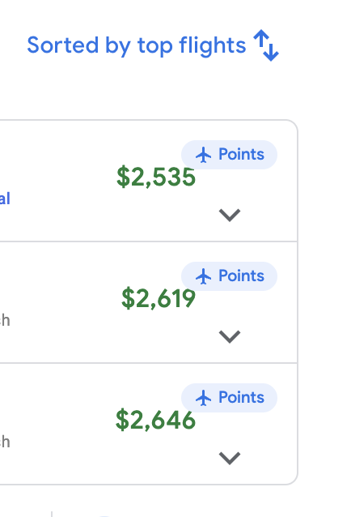

# Seats.aero for Google Flights

A Chrome extension that bridges Google Flights and [seats.aero](https://seats.aero) for award travel. Search award availability from Google Flights, and see Google Flights cash prices with cents-per-point (CPP) calculations on seats.aero.

| Global search button | Per-flight buttons | Popup settings |
|---|---|---|
|  |  |  |

## Features

### Google Flights → seats.aero
- **Global search button** — appears in the Google Flights filter bar, searches your entire route on seats.aero
- **Per-flight "Points" buttons** — appear on each flight result row, search that specific airport pair + airline
- **Smart filter mapping** — automatically transfers origin, destination, date, cabin class, passenger count, nonstop filter, and airline
- **Reverse search button** — one-way searches get a "↩ Return" button to quickly check the reverse direction
- **Configurable flexible dates** — search ±3, ±5, ±7, or ±14 days around your date

### seats.aero → Google Flights
- **Google Flights links** — clickable links on every award result that open Google Flights with the correct route, date, cabin, and airline
- **Cash price display** — fetches the actual Google Flights cash price for each flight and shows it inline
- **CPP calculation** — calculates cents-per-point (cash price / points cost) displayed to 2 decimal places
- **Per-flight pricing** — matches the exact flight number (e.g., AA2848) to its specific cash price, not just the cheapest on the route
- **CPP color coding** — green highlight when CPP >= 2.0 (great redemption value)
- **Min CPP filter** — set a minimum CPP threshold in the popup to only show good deals
- **Works on both views** — supports Individual Flights and Program Summary tables

## Filter Mapping

| Google Flights | seats.aero | Notes |
|---|---|---|
| Origin | `origins` | Metro codes (NYC) or specific airports (EWR) |
| Destination | `destinations` | Same as above |
| Date | `date` | YYYY-MM-DD format |
| Cabin class | `applicable_cabin` | economy / premium / business / first |
| Passengers | `min_seats` | Total passenger count |
| Nonstop filter | `direct_only` | Per-flight: auto-detected. Global: from filter bar |
| Airline | `op_carriers` | Per-flight: from the flight row. Global: from filter bar |

Filters without a seats.aero equivalent (bags, price, times, emissions, duration, connecting airports) are skipped.

## Install

1. Clone or download this repo
2. Open Chrome → `chrome://extensions/`
3. Enable **Developer mode** (top right)
4. Click **Load unpacked**
5. Select this folder

## Usage

### On Google Flights
1. Search for flights on [Google Flights](https://www.google.com/travel/flights)
2. Click **"Search on seats.aero"** in the filter bar to search the whole route
3. Or click **"Points"** on any flight row to search that specific flight
4. seats.aero opens in a new tab with filters pre-filled

### On seats.aero
1. Search for award availability on [seats.aero](https://seats.aero)
2. Each result shows a Google Flights link with the cash price and CPP
3. Click the link to open Google Flights filtered to that airline
4. Set a minimum CPP in the popup to filter out low-value redemptions

## Requirements

- Google Chrome (Manifest V3)
- [seats.aero](https://seats.aero) account (Pro recommended for full filter access)

## Project Structure

```
├── manifest.json      # Extension manifest (Manifest V3)
├── content.js         # Google Flights content script: button injection, filter extraction
├── seats-content.js   # seats.aero content script: link injection, CPP calculation
├── protobuf.js        # Protobuf encoder for Google Flights deep-link URLs
├── background.js      # Service worker: tab creation + Google Flights price fetching
├── airlines.js        # Airline name → IATA code lookup (~100 airlines)
├── styles.css         # Button styling for Google Flights
├── seats-styles.css   # Link styling for seats.aero
├── popup.html         # Extension popup UI
├── popup.js           # Popup settings handler
└── icons/             # Extension icons (16, 48, 128px)
```

## License

MIT
