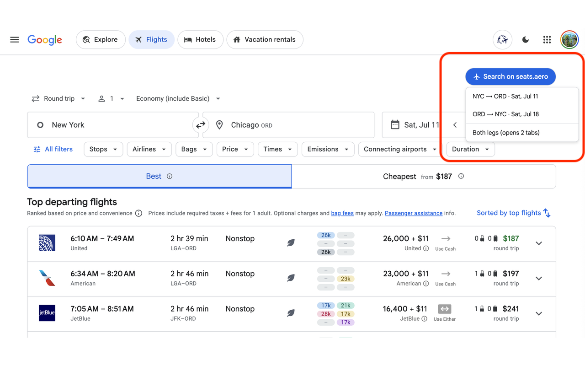
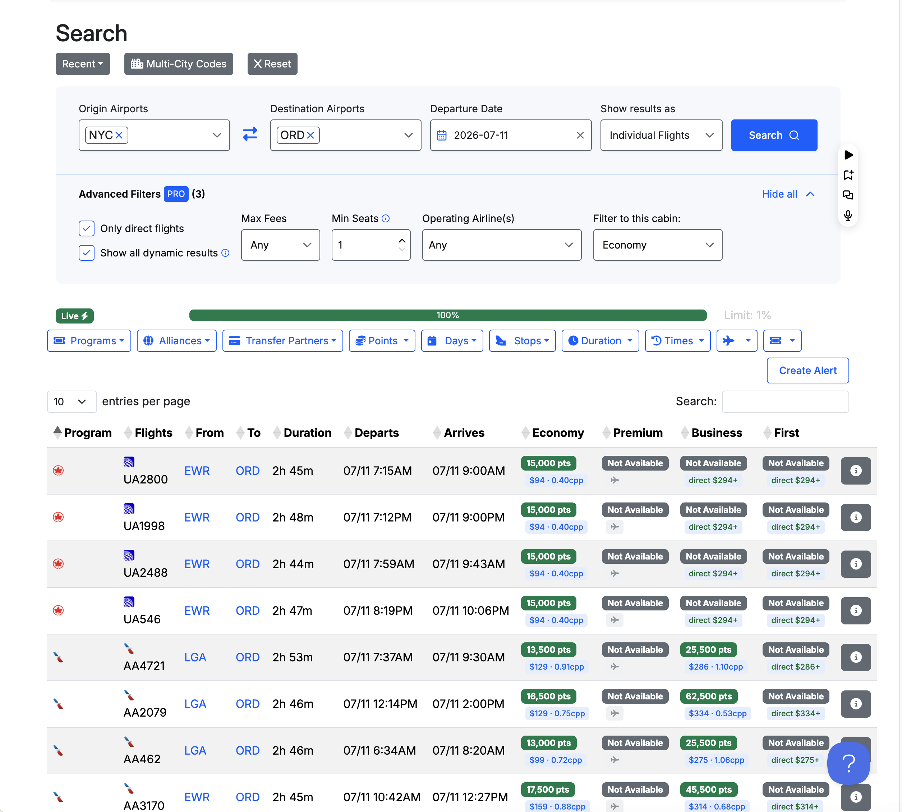
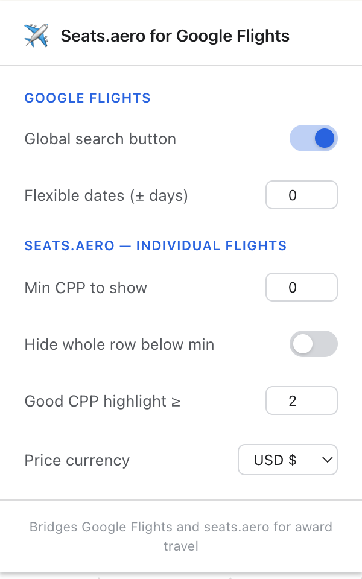

# Seats.aero for Google Flights

A Chrome extension that bridges [Google Flights](https://www.google.com/travel/flights) and [seats.aero](https://seats.aero) for award travel.

Search award availability from Google Flights with one click, and see Google Flights cash prices with cents-per-point (CPP) calculations on seats.aero results.

## Demo

https://github.com/user-attachments/assets/d69b9272-b720-48ab-a747-9acca5a5d7e3

## Screenshots

| Google Flights | seats.aero | Settings |
|---|---|---|
|  |  |  |

## Features

### Google Flights → seats.aero
- **Search button** — appears in the Google Flights filter bar, opens seats.aero with your route pre-filled
- **Smart filter mapping** — automatically transfers origin, destination, date, cabin class, passenger count, nonstop filter, and airline selection
- **Round-trip support** — opens two tabs (outbound + return) for round-trip searches

### seats.aero → Google Flights
- **Cash price + CPP** — fetches the actual Google Flights cash price and calculates cents-per-point inline on every award result (e.g., "$352 · 1.41cpp")
- **Per-flight pricing** — matches the exact flight number to its specific cash price, not just the cheapest on the route
- **CPP color coding** — green highlight when CPP >= 2.0 (great redemption value)
- **Min CPP filter** — set a minimum CPP threshold in the popup to hide low-value redemptions
- **Both views supported** — works on Individual Flights and Program Summary tables

## Filter Mapping

| Google Flights | seats.aero | Notes |
|---|---|---|
| Origin | `origins` | Metro codes (NYC) or specific airports (EWR) |
| Destination | `destinations` | Same as above |
| Date | `date` | YYYY-MM-DD format |
| Cabin class | `applicable_cabin` | economy / premium / business / first |
| Passengers | `min_seats` | Total passenger count |
| Nonstop filter | `direct_only` | From Stops filter |
| Airline | `op_carriers` | From Airlines filter |

Filters without a seats.aero equivalent (bags, price, times, emissions, duration, connecting airports) are skipped.

## Install

1. Clone or download this repo
2. Open Chrome → `chrome://extensions/`
3. Enable **Developer mode** (top right)
4. Click **Load unpacked**
5. Select this folder

## Usage

### On Google Flights
1. Search for flights on [Google Flights](https://www.google.com/travel/flights)
2. Click **"Search on seats.aero"** in the filter bar
3. seats.aero opens in a new tab with your search filters pre-filled

### On seats.aero
1. Search for award availability on [seats.aero](https://seats.aero)
2. Each result shows the Google Flights cash price and CPP value inline
3. Results with CPP >= 2.0 are highlighted in green — indicating a good redemption value
4. Set a minimum CPP in the extension popup to filter out low-value results

## Requirements

- Google Chrome (Manifest V3)
- [seats.aero](https://seats.aero) account (Pro recommended for full access)

## Project Structure

```
├── manifest.json      # Extension manifest (Manifest V3)
├── content.js         # Google Flights content script: button injection, filter extraction
├── seats-content.js   # seats.aero content script: link injection, CPP calculation
├── protobuf.js        # Protobuf encoder for Google Flights deep-link URLs
├── background.js      # Service worker: tab management + Google Flights price fetching with LRU cache
├── airlines.js        # Airline name → IATA code lookup (~100 airlines)
├── metros.js          # City/metro name → IATA airport code lookup
├── styles.css         # Button styling for Google Flights
├── seats-styles.css   # Link styling for seats.aero
├── popup.html         # Extension popup UI
├── popup.js           # Popup settings handler
└── icons/             # Extension icons (16, 48, 128px)
```

## License

MIT
